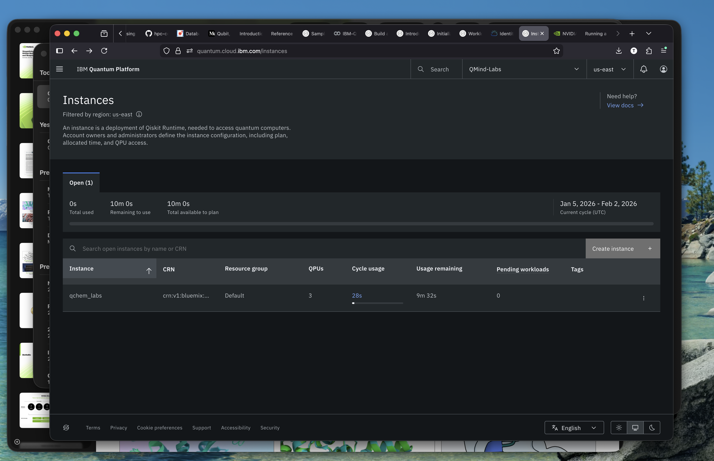
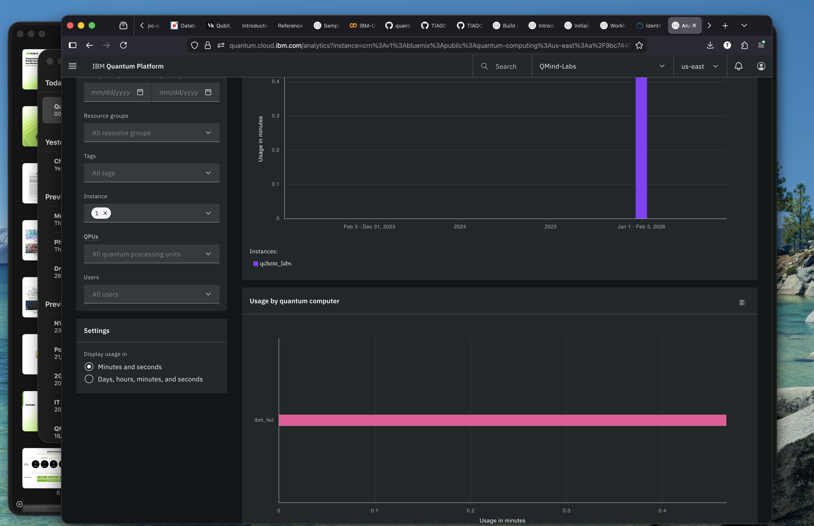
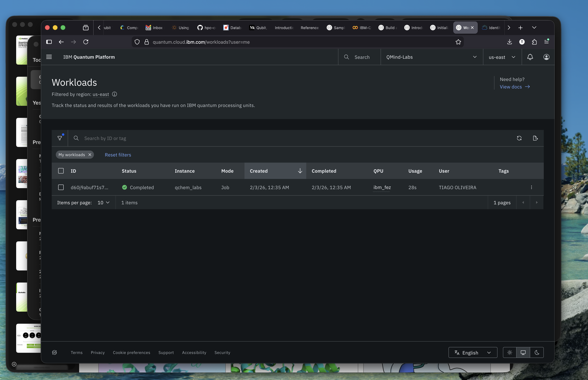
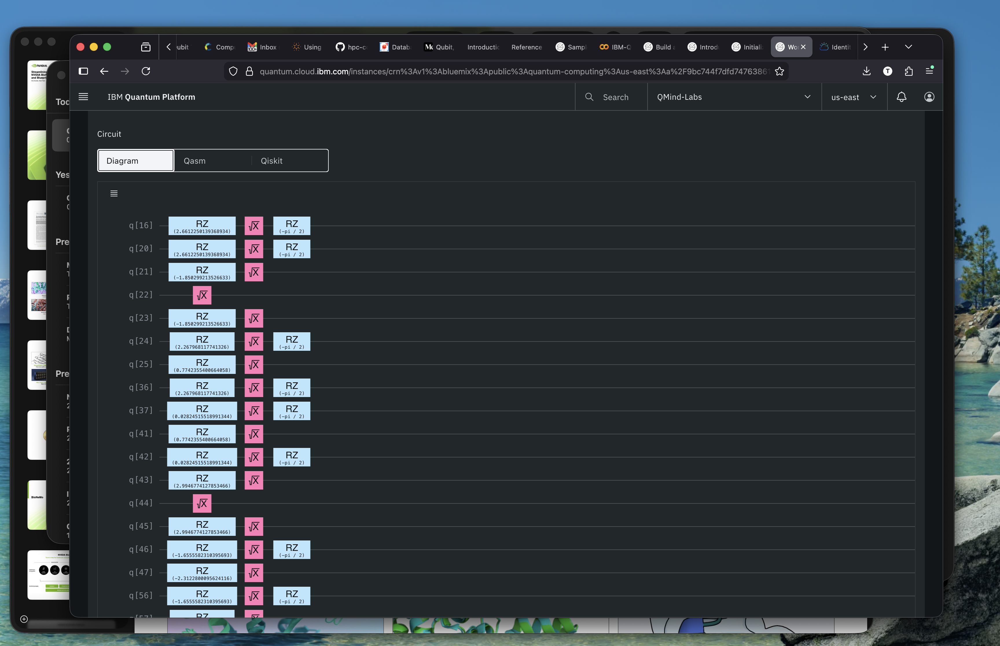
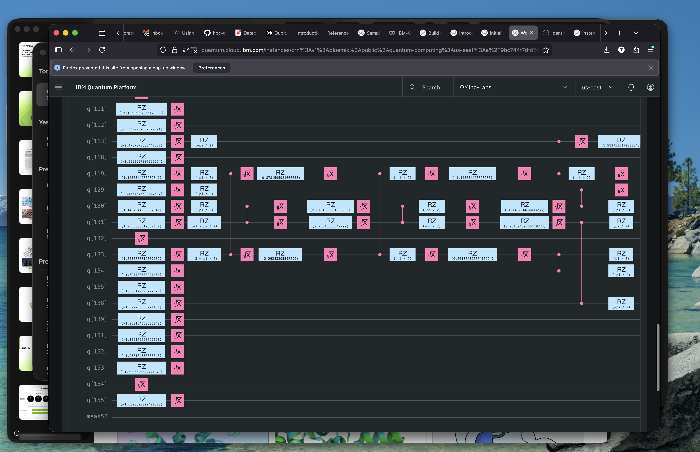
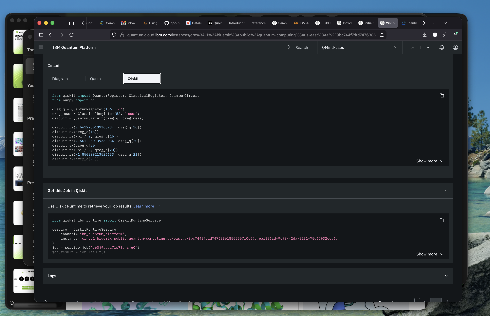
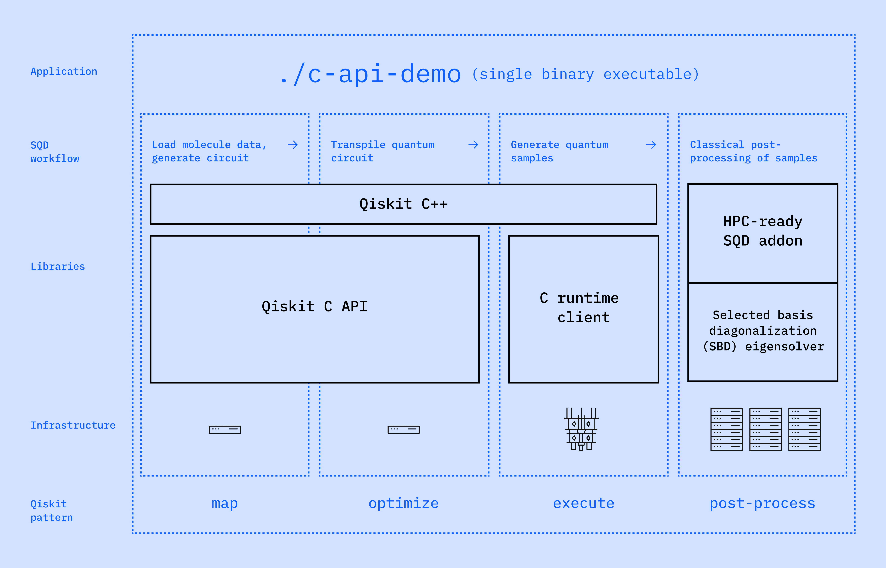

# Exploratory Lab – Sample-based Quantum Diagonalization with IBM Quantum & Qiskit

This repository documents my **exploratory hands-on work with IBM Quantum**, based on the official IBM Quantum tutorial:

👉 **Sample-based Quantum Diagonalization**  
https://quantum.cloud.ibm.com/docs/en/tutorials/sample-based-quantum-diagonalization

The goal of this lab is to:
- Understand how **sample-based quantum diagonalization** works in practice
- Learn how to **run workloads on IBM Quantum backends** using modern Qiskit APIs
- Inspect and interpret **ground-state energy convergence** across iterations
- Familiarize myself with the **IBM Quantum platform dashboard**, workloads, and instances

This work is exploratory and meant as a **learning + benchmarking foundation** for future comparisons against classical HPC and emerging quantum workflows.

---

## 1. Environment Setup & Notebook Configuration

This lab is designed to be executed from a **Jupyter Notebook**, either:
- Locally (recommended for experimentation)
- Or using IBM’s managed online lab environments

### 1.1 Local Python Environment

Recommended Python version:
- **Python 3.11 or newer**

Create and activate a virtual environment:

```bash
python3 -m venv qiskit-env
source qiskit-env/bin/activate

pip install --upgrade pip
````

Install required dependencies:

```bash
%pip install qiskit qiskit-ibm-runtime
%pip install qiskit-ibm-catalog
%pip install qiskit-addon-sqd
%pip install ffsim
%pip install qiskit-serverless

```

Register the kernel:

```bash
python -m ipykernel install --user \
  --name=qiskit-env \
  --display-name "Qiskit IBM Quantum"
```

Start Jupyter (using a non-default port if needed):

```bash
jupyter lab --port=8895
```

---

### 1.2 IBM Quantum Online Lab Environments

IBM also provides **preconfigured notebook environments**, which can be useful for quick experimentation:

📘 Online lab environments guide:
[https://quantum.cloud.ibm.com/docs/en/guides/online-lab-environments](https://quantum.cloud.ibm.com/docs/en/guides/online-lab-environments)

These environments already include:

* Qiskit
* IBM Quantum runtime libraries
* Pre-authenticated access (depending on configuration)

---

## 2. Connecting to IBM Quantum (API & Runtime)

To run workloads on IBM Quantum backends, you need an **IBM Cloud API key**.

### 2.1 Getting an API Key

Create or manage your API keys here:

🔑 IBM Cloud API keys
[https://cloud.ibm.com/iam/apikeys](https://cloud.ibm.com/iam/apikeys)

---

### 2.2 Initializing the Qiskit Runtime Service

In the notebook, initialize the service as follows:

```python
from qiskit_ibm_runtime import QiskitRuntimeService

service = QiskitRuntimeService(
    token="YOUR_API_KEY",
    channel="ibm_quantum_platform",
    instance="crn:v1:bluemix:public:quantum-computing:us-east:...::"
)
```

References:

* IBM Quantum Runtime basics:
  [https://quantum.cloud.ibm.com/docs/en/tutorials/sample-based-quantum-diagonalization](https://quantum.cloud.ibm.com/docs/en/tutorials/sample-based-quantum-diagonalization)
* Qiskit Serverless & runtime execution model:
  [https://qiskit.github.io/qiskit-serverless/getting_started/basic/01_running_program.html](https://qiskit.github.io/qiskit-serverless/getting_started/basic/01_running_program.html)

Once initialized, this `service` object is used to:

* Query available backends
* Submit quantum workloads
* Monitor execution status

---

## 3. IBM Quantum Platform Dashboard – Key Areas

During this lab, three areas of the IBM Quantum dashboard are especially relevant.

### 3.1 Quantum Catalog

📦 Catalog repository & documentation:
[https://github.com/Qiskit/qiskit-ibm-catalog](https://github.com/Qiskit/qiskit-ibm-catalog)

The catalog provides:

* Predefined quantum programs
* Sample workflows
* Reference implementations optimized for IBM hardware


---

### 3.2 Instances

📍 Instances dashboard:
[https://quantum.cloud.ibm.com/instances](https://quantum.cloud.ibm.com/instances)

Instances define:

* Billing context
* Backend access
* Runtime quotas and limits

They are effectively the **execution boundary** for workloads.

**Screenshot placeholders:**






---

### 3.3 Workloads

📊 Workloads dashboard:
[https://quantum.cloud.ibm.com/workloads?user=me](https://quantum.cloud.ibm.com/workloads?user=me)

This view allows you to:

* Monitor submitted jobs
* Inspect execution states
* Review runtime logs and metadata

**Screenshot placeholders:**







---

## 4. Result Analysis – Ground State Energy Estimation

The core result of this lab is the **iterative estimation of the ground state energy of a Hamiltonian**, using sample-based diagonalization.

Below is a summary of the observed results:

### Iteration 1

* Energy converges quickly at **-108.94656**
* Small subspace dimension (~13k)
* Indicates a **coarse initial approximation**

### Iteration 2

* Energy improves to ~**-109.11**
* Subspace grows to ~270k–300k
* More expressive basis captures additional correlations

### Iteration 3

* Energy stabilizes near **-109.145**
* Subspace dimension increases further (~450k)
* Reduced variance across subsamples

### Iteration 4

* Energy reaches ~**-109.17**
* Subspace size grows beyond ~650k
* Indicates diminishing returns with growing cost

### Iteration 5

* Energy converges around **-109.185**
* Subspace exceeds **800k**
* Marginal energy improvements suggest convergence

---

### Interpretation

Key observations:

* **Monotonic energy decrease** across iterations is expected for variational-style diagonalization
* Increasing subspace dimension improves accuracy but increases computational cost
* Variance across subsamples decreases, indicating **stability and convergence**
* The final iterations show **diminishing returns**, a typical trade-off in quantum/classical hybrid methods

The notebook visualizations (energy vs iteration, subspace growth, variance across subsamples) provide deeper insight into:

* Convergence behavior
* Cost vs accuracy trade-offs
* Sampling noise impact

---

## 5. Next Steps & Extensions

Possible follow-ups to this work:

* Benchmark against classical diagonalization for small systems
* Study scaling behavior as Hamiltonian size increases
* Integrate this workflow into a broader **HPC + quantum hybrid benchmark** -> [Video: When Quantum Joins Supercomputing](www.youtube.com/watch?v=BCmgyNDDnL8) , [Github](https://github.com/christopherporter1/hpc-course-demos)
* Hybrid workflow for c/c++ runtime [Quantum + HPC](https://www.ibm.com/quantum/blog/c-api-enables-end-to-end-hpc-demo)


---

## References

* IBM Quantum Sample-based Diagonalization Tutorial
  [https://quantum.cloud.ibm.com/docs/en/tutorials/sample-based-quantum-diagonalization](https://quantum.cloud.ibm.com/docs/en/tutorials/sample-based-quantum-diagonalization)

* IBM Quantum Online Lab Environments
  [https://quantum.cloud.ibm.com/docs/en/guides/online-lab-environments](https://quantum.cloud.ibm.com/docs/en/guides/online-lab-environments)

* Qiskit Serverless – Running Programs
  [https://qiskit.github.io/qiskit-serverless/getting_started/basic/01_running_program.html](https://qiskit.github.io/qiskit-serverless/getting_started/basic/01_running_program.html)

* IBM Cloud API Keys
  [https://cloud.ibm.com/iam/apikeys](https://cloud.ibm.com/iam/apikeys)

